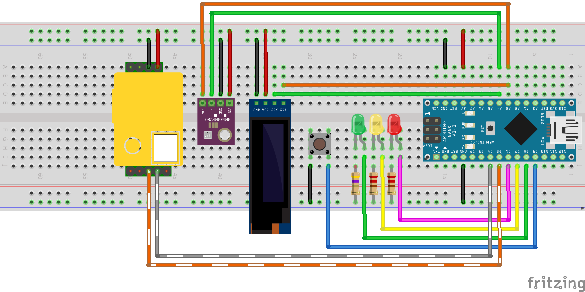

# CO2meter
Температура, влажность, давление, CO2
- [Возможности]
- [Библиотеки](https://github.com/killadog/CO2meter#%D0%B1%D0%B8%D0%B1%D0%BB%D0%B8%D0%BE%D1%82%D0%B5%D0%BA%D0%B8)
- [Компоненты]
- [Схемы](https://github.com/killadog/CO2meter#%D1%81%D1%85%D0%B5%D0%BC%D1%8B)
## Возможности
- Текущая температура, влажность, давление и значение CO2
- Минимальные и максимальные значения
- Управление одной кнопкой
- Цветовая индикация состояния CO2:
зелёный CO2<800
жёлтый 
## Библиотеки
- [GyverButton](https://github.com/AlexGyver/GyverLibs/tree/master/GyverButton) - работа с кнопками.
- [GyverUART](https://github.com/AlexGyver/GyverLibs/tree/master/GyverUART) - быстрая и лёгкая библиотека для работы с Serial.
- [SparkFun BME280](https://github.com/sparkfun/SparkFun_BME280_Arduino_Library) - библиотека для датчика BME280 (температура, влажность, давление).
- [MH-Z19](https://github.com/WifWaf/MH-Z19) - библиотека для MH-Z19 и MH-Z19B CO2 датчиков.
- [U8g2](https://github.com/olikraus/u8g2) - графическая библиотека для монохромных OLED дисплеев.
## Компоненты

- Arduino Nano
- OLED SSD1306 128x32
- BME280
- MH-Z19B

## Схемы

