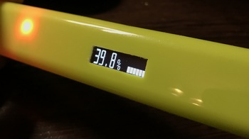
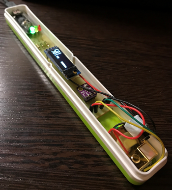
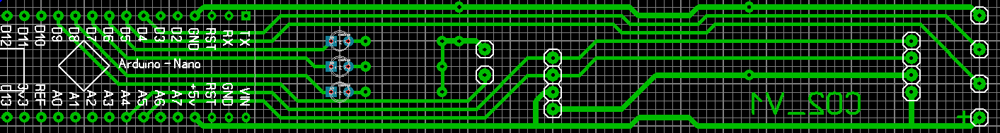
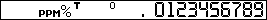
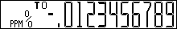

# CO2meter




- [Возможности](https://github.com/killadog/CO2meter#%D0%B2%D0%BE%D0%B7%D0%BC%D0%BE%D0%B6%D0%BD%D0%BE%D1%81%D1%82%D0%B8)
- [Компоненты](https://github.com/killadog/CO2meter#%D0%BA%D0%BE%D0%BC%D0%BF%D0%BE%D0%BD%D0%B5%D0%BD%D1%82%D1%8B)
- [Схемы](https://github.com/killadog/CO2meter#%D1%81%D1%85%D0%B5%D0%BC%D1%8B)
- [Библиотеки](https://github.com/killadog/CO2meter#%D0%B1%D0%B8%D0%B1%D0%BB%D0%B8%D0%BE%D1%82%D0%B5%D0%BA%D0%B8)
- [Шрифты](https://github.com/killadog/CO2meter#%D1%88%D1%80%D0%B8%D1%84%D1%82%D1%8B)
## Возможности
- Текущее значение CO2, температуры, влажности и давления:
  - датчик на экран;
  - все датчики на одном экране.
- Отображение минимального и максимального значения для каждого датчика.
- Управление одной кнопкой:
  - одно нажатие - следущий датчик;
  - два нажатия - смена режима (обычный / min-max режим);
  - удержание - переворот экрана.
- Цветовая индикация концентрации CO2:
  - зелёный - менее 800 ppm;
  - жёлтый - от 800 до 1000 ppm;
  - красный - более 1000 ppm.
- Вывод значений в Serial.
## Компоненты
- Arduino Nano
- MH-Z19B
- BME280
- OLED SSD1306 128x32
## Схемы

Для изготовления платы в формате Sprint Layout

[CO2.lay](CO2.lay)



## Библиотеки

- [MH-Z19](https://github.com/WifWaf/MH-Z19) - библиотека для MH-Z19 и MH-Z19B CO2 датчиков.
- [SparkFun BME280](https://github.com/sparkfun/SparkFun_BME280_Arduino_Library) - библиотека для датчика BME280 (температура, влажность, давление).
- [U8g2](https://github.com/olikraus/u8g2) - графическая библиотека для монохромных OLED дисплеев.
- [GyverButton](https://github.com/AlexGyver/GyverLibs/tree/master/GyverButton) - работа с кнопками.
## Шрифты
Шрифты созданы с помощью [Fony 1.4.7-WIP](http://hukka.ncn.fi/?fony) и конвертированы для вставки в скетч с помощью [bdfconv](https://github.com/olikraus/u8g2/tree/master/tools/font/bdfconv).

 [lcdnums_10x16.fon](lcdnums_10x16.fon)

 [lcdnums_12x32.fon](lcdnums_12x32.fon)

<details> 
  <summary>Код шрифтов для вставки в свой скетч</summary>

```

const uint8_t lcdnums_10x16[330] U8G2_FONT_SECTION("lcdnums_10x16") =
  "\26\0\4\3\5\4\3\4\6\26\17\0\373\12\0\0\0\0\0\0\0\1\61$ \365:\66\224\224\310\220"
  "H\210HL\224H\210H\34\210H\210HHD\234\224\310P\251\241R#%\33\212;l\214\305D\305"
  "\244\210\11\211\31\11\314d&$&*&*&l\2\0&\13\346\274)\34\224\10\351\4\0'\5\0"
  "\210)(\5\0\210))\5\0\210)*\14\345\274gL\304\350&b\2\0+\5\0\210),\5\0"
  "\210)-\5\0\210).\6b\70$\30/\5\0\210)\60\20\351\71k\134DTL\361\277\232\250\210"
  "\270\0\61\13\346=+\320\14\351 rP\62\24\351\71+\34\204X\304\351\302B\302BNw\21&\7"
  "\1\63\24\351\71+\34\204X\304\351\244\42\342\62N\27\26\7\22\0\64\16\351\71+H\361\325DE\304"
  "e\234>\65\24\351\71k\34HX\310i\27ar\20\247\27\26\7\22\0\66\25\351\71k\34HX\310"
  "ix\21Q\61\305\253\211\212\210\13\0\67\16\351\71+\34\204X\304)\323\235~\4\70\27\351\71k\134"
  "DTLq\65Q\21q\21\67\305\325DE\304\5\0\71\25\351\71k\134DTLq\65Q\21q\31"
  "\247\13\213\3\11\0\0\0\0";
  
  const uint8_t lcdnums_12x32[407] U8G2_FONT_SECTION("lcdnums_12x32") =
  "\26\0\4\3\4\6\4\6\6\21 \0\354\14\0\0\0\0\0\0\0\1~$%\237(\23\303\310H\214"
  "HDH\204\304HDH\204\304HDHD\12\222\221\210\10\241\64Bi\204\322\10\245\11%%Y-"
  "\303\306TLPLPLPLPLPL\324L\134\276\231\212\11\212\11\212\11\212\11\212\11\212\211\232"
  "\0&\13\226\354\230\302A\211\220>\1'\6\0 \10\2(\6\0 \10\2)\6\0 \10\2*\14"
  "\226\354\230\6E\220>\212\240\0+\6\0 \10\2,\6\0 \10\2-\10\66\350\246\302\3\2.\10"
  "R\60\243\302\301\0/\6\0 \10\2\60\25\12*\343\306AD\204\305\30\377\377\377g\23\26\21\7\21"
  "\0\61\16\6\62\343\2\315\220\376\377\377O\16\12\62\30\12*\343\302\201\310E\240\376/,&,&,"
  "\4\365 \30qr \63\34\12*\343\302\3\212\210\3A\375\207\7\23\7\23\7\21\201\372\277\70\70\230"
  "\70\230\0\64\23\12*\343\202\30\377\277\240\230\260\210\70\210\24\324\377\7\65\30\12*\343\306\301\304\205\240"
  "\376/,\42,\42,\4\365\377\342\301\4\0\66\32\12*\343\306\301\304\205\240\376\207\21'\27\22\25d"
  "\374?\233\260\210\70\210\0\67\26\12*\343\302\201\310E\240\356\4\345\4\345\4\345\4\365\377?\2\70\35"
  "\12*\343\306AD\204\305\30\377g\23\26\21\7\21\21\26c\374?\233\260\210\70\210\0\71\30\12*\343"
  "\306AD\204\305\30\377/*$N.\2\365\377\342\301\4\0\0\0\0";
  
  ```
  
  </details>
